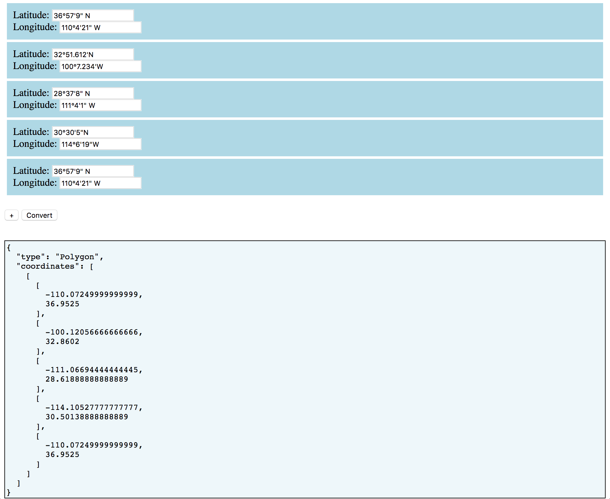

# Instructions

Try it here: https://eio.github.io/geojson-tool/

Enter latitude and longitude in DMS format:

	36°57'9.12" N
	110°4'21.0" W

**Required:** degrees (°), minutes('), direction (N E S or W).

Omitting seconds (") will be interpreted as a value of 0 seconds.

Press the plus (+) button to add a new latlon input field.

Press the `Convert` button to generate GeoJSON Polygon output.

Note that the list of `[Longitude,Latitude]` pairs in a GeoJSON Polygon must start and end with the same exact point in order to properly close the polygon.

Copy your GeoJSON into http://geojson.io/ to click+drag the polygon's vertices
